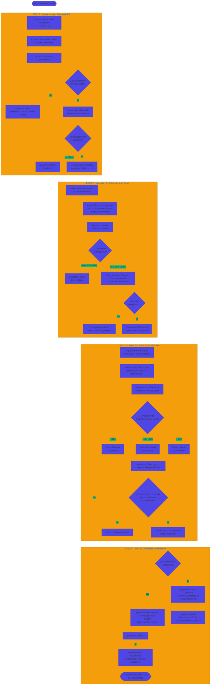

# StudySync ⏱️🧠

> Plataforma web de estudio colaborativo y gamificación en tiempo real que integra métricas fisiológicas (estrés y HRV) mediante dispositivos *wearables* para monitorear la carga cognitiva durante sesiones de enfoque.

---

# ✨ Características Principales

- 📚 Salas de estudio colaborativas en tiempo real.
- 🧠 Monitoreo de estrés y variabilidad cardíaca (HRV) basado en RMSSD.
- 📊 Dashboard de métricas fisiológicas y productividad (Índice de Eficiencia de Estudio - IES).
- 🏆 Sistema de gamificación y recompensa por experiencia (XP).
- 📱 Diseño responsive (*mobile-first*).
- 🔗 Integración BLE (*Bluetooth Low Energy*) con dispositivos biomédicos (ej. HealthyPi 5 / RP2040).
- ⚡ Comunicación en tiempo real mediante WebSockets (Flask-SocketIO) adaptada para desarrollo ágil.

---

# 🏗️ Arquitectura del Sistema y Red

El proyecto utiliza una arquitectura modular que conecta el hardware biomédico con un backend en Flask, permitiendo procesar bioseñales en tiempo real sin saturar la experiencia del usuario.

```text
[ Wearable (HealthyPi 5 / BLE) ]
            │
            │ Web Bluetooth API (Filtros: Pasa-altas, Pasa-bajas, Notch 60 Hz)
            ▼
[ Frontend (Dashboard Web) ]
  ├── Animación de ECG e Ingesta de Lotes RR
  ├── Formulario EVA (Escala Visual Analógica) y Confundidores
  └── Study Rooms (Salas Colaborativas)
            │
            │ WebSockets / Socket.IO (Tráfico bidireccional en tiempo real)
            ▼
[ Puerto Local 5000 ] <─── [ Túnel Seguro NGROK ] <─── [ Internet / Dispositivo Móvil ]
            │
            ▼
[ Backend (Flask Server) ]
  └── Procesamiento HRV (Filtro de artefactos, Cómputo de RMSSD, Algoritmo IES)
````

### 🔌 ¿Por qué usamos Flask-SocketIO y ngrok juntos?

1. **Flask-SocketIO (El Motor de Tiempo Real):** A diferencia de las peticiones HTTP convencionales donde el cliente debe preguntar constantemente si hay cambios, Socket.IO mantiene un canal abierto y bidireccional. Permite que en cuanto el backend detecte **estrés elevado sostenido (≥10 min)**, emita inmediatamente una alerta (`rest_alert`) hacia el frontend de forma instantánea.

2. **ngrok (El Puente de Red Seguro):** Cuando corres Flask en tu entorno local, el servidor solo es accesible en tu propia máquina (`localhost:5000`). Para conectar un celular real, una tablet o probar el emparejamiento Web Bluetooth (que **exige estrictamente un origen seguro HTTPS**), ngrok crea un túnel público inverso en internet redirigiendo el tráfico de forma segura hacia tu puerto local.

---

# 📂 Estructura del Proyecto

```text
StudySync/
│
├── main.py                # Servidor Flask, gestión de estados de sesión y eventos WebSocket
├── requirements.txt       # Dependencias del proyecto (Flask, Flask-SocketIO, etc.)
└── templates/
    └── index.html         # Dashboard principal, gráficos en Canvas y orquestación de Web Bluetooth
```

---

# 🚀 Guía de Instalación y Despliegue Local

Sigue estos pasos detallados para configurar y ejecutar el entorno de desarrollo en tu máquina.

## 1️⃣ Clonar o posicionarse en el proyecto

Abre tu terminal (o PowerShell si estás en PyCharm) y asegúrate de estar dentro de la carpeta raíz del proyecto:

```powershell
cd proyecto_intrus
```

## 2️⃣ Crear el Entorno Virtual (`.venv`)

### En Windows

```powershell
py -m venv .venv
```

### En macOS / Linux

```bash
python3 -m venv .venv
```

## 3️⃣ Activar el Entorno Virtual

### Windows (PowerShell)

```powershell
.\.venv\Scripts\Activate.ps1
```

> Si aparece un error de permisos de ejecución, ejecuta primero:

```powershell
Set-ExecutionPolicy -ExecutionPolicy RemoteSigned -Scope Process
```

### Windows (CMD)

```cmd
.\.venv\Scripts\activate.bat
```

### macOS / Linux

```bash
source .venv/bin/activate
```

Cuando el entorno esté activo aparecerá el prefijo `(.venv)` en la consola.

## 4️⃣ Instalar Dependencias

```powershell
pip install -r requirements.txt
```

## 5️⃣ Levantar el Servidor Flask

```powershell
python main.py
```

El servidor se iniciará en el puerto **5000** utilizando `allow_unsafe_werkzeug=True`.

---

# 🌐 Configuración del Túnel con ngrok (Pruebas en Dispositivos Reales)

1. Abre una nueva terminal.
2. Ejecuta:

```bash
ngrok http 5000
```

3. Copia la URL HTTPS generada (por ejemplo `https://xxxx-xxxx.ngrok-free.app`).
4. Ábrela desde Google Chrome en tu dispositivo móvil para utilizar Web Bluetooth.

---

# 🔄 Flujo de Usuario Completo



---

# 📊 Fórmulas Clave Implementadas en el Backend

### RMSSD

$$
\text{RMSSD} =
\sqrt{
\frac{1}{N-1}
\sum_{i=1}^{N-1}
(RR_{i+1}-RR_i)^2
}
$$

### Variación porcentual

$$
\text{Variación %} =
\left|
\frac{\text{RMSSD}*{actual}-\text{RMSSD}*{basal}}
{\text{RMSSD}_{basal}}
\right|
\times100
$$

### Índice de Eficiencia de Estudio (IES)

$$
\text{IES}
==========

## T_{\text{efectivo(min)}}

P_{\text{estrés}}
+
B_{\text{descanso}}
+
B_{\text{retorno}}
$$

Donde:

* (P_{\text{estrés}} = \text{periodos ignorados} \times 5)
* (B_{\text{descanso}} = \text{aceptados} \times 3)
* (B_{\text{retorno}} = \text{retornos completados} \times 2)

### Puntos de Experiencia

$$
\text{XP} = \text{IES} \times 10
$$

---

Desarrollado para el proyecto de **Instrumentación Biomédica (C0688)** — *Universidad Peruana Cayetano Heredia*.


Si lo prefieres, también puedo entregártelo como un archivo **`README.md`** descargable.
```

